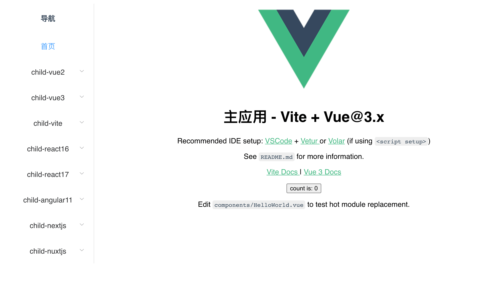

# 简介

micro-app-demo 作为 [micro-app](https://github.com/micro-zoe/micro-app) 的案例仓库，举例了 `react`, `vue`, `angular`, `nextjs`, `nuxtjs`, `vite` 如何作为主应用和子应用接入微前端，并在尽可能改动少量的代码的情况下做出尽可能完善的功能。

micro-app-demo 中所有项目都是使用官方脚手架创建的，它们足够精简，你完全可以将其中的 demo 作为基础进一步开发自己的项目。

# 目录结构

```
.
├── child_apps
│   ├── sidebar          // 子应用 sidebar，公共侧边栏
│   ├── vite-vue3        // 子应用 vite (hash路由)
├── main_apps
│   ├── vite-vue3        // 主应用 vite (history路由)
├── package.json
└── yarn.lock
```

# 开始

## 1、安装依赖

```bash
yarn bootstrap
```

如果失败，建议单独进入子目录执行`yarn`安装。

## 2、运行项目

各主应用都监听了 3000 端口，所以只能同时启动一个主应用，而子应用端口各不相同，可以同时启动。

**1、启动 vite 主应用**

```bash
yarn dev:main-vite
```

访问：`http://localhost:3000/main-vite`

此时分别运行 `main_apps/vite-vue3` 以及 `child_apps` 文件夹下的所有子应用。

**2、启动 vite 子应用**
运行 `child_apps/vite-vue3` 子应用。

在子应用中引入第三方 UI

```
<a href="undefined">test</a>
<a-link type="text" @click="onClick">ALink标签</a-link>
```

## 效果如下：



# 补充

- 1、如果你在安装依赖或启动项目时发生错误，可以尝试单独进入每个项目执行操作。
- 2、因为每个主应用都有侧边栏，一次次写太麻烦，所以将侧边栏单独分离出来作为子应用，也就是 `child-sidebar`，实际项目中不需要这样做，侧边栏一般放到主应用中。
- 3、因为 nextjs 和 nuxtjs 的基础路由是写死的，而 child-nextjs11，child-nuxtjs2 分别嵌入了多个主应用，每个主应用下的基础路由都不同，所以单独为每个主应用单独打包构建不同版本（main_apps/nextjs11, main_apps/nuxtjs2 略微不同，它们单独绑定了端口，处于根目录，可以共用一个版本）。
